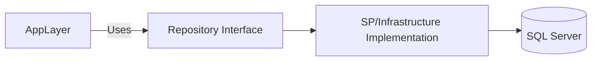
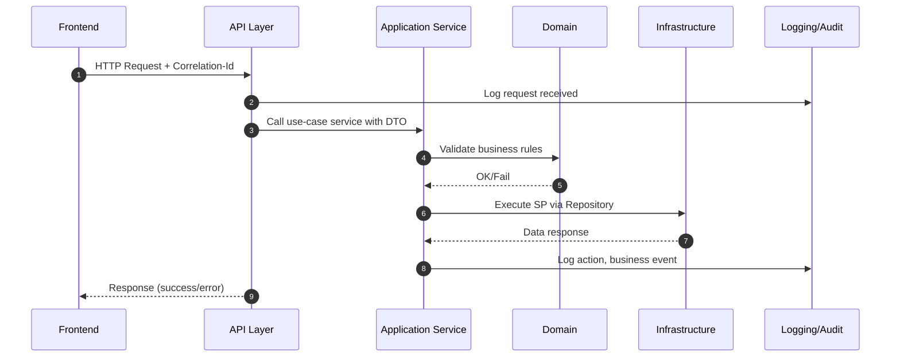
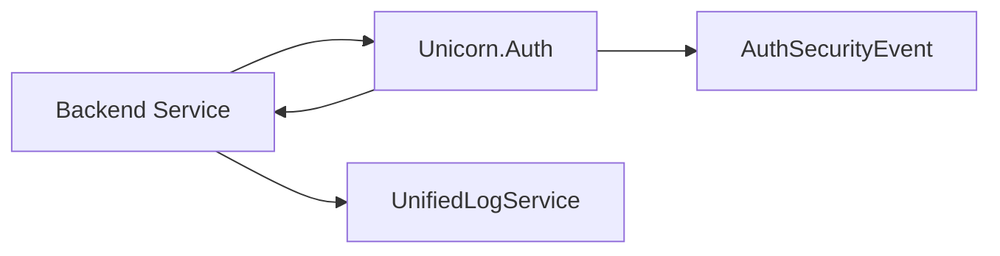
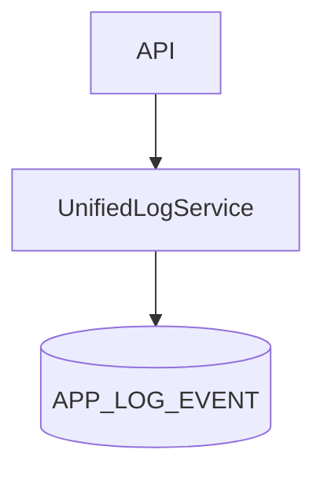
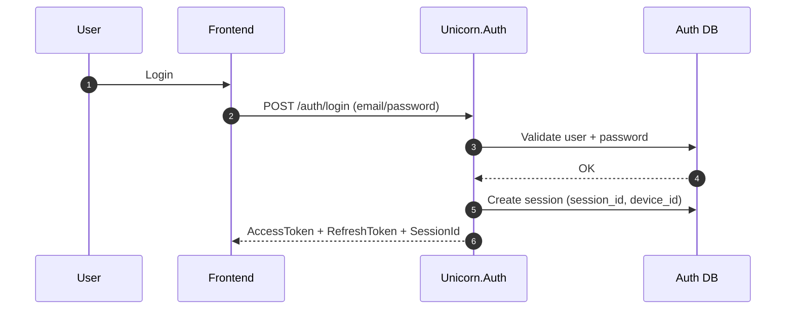
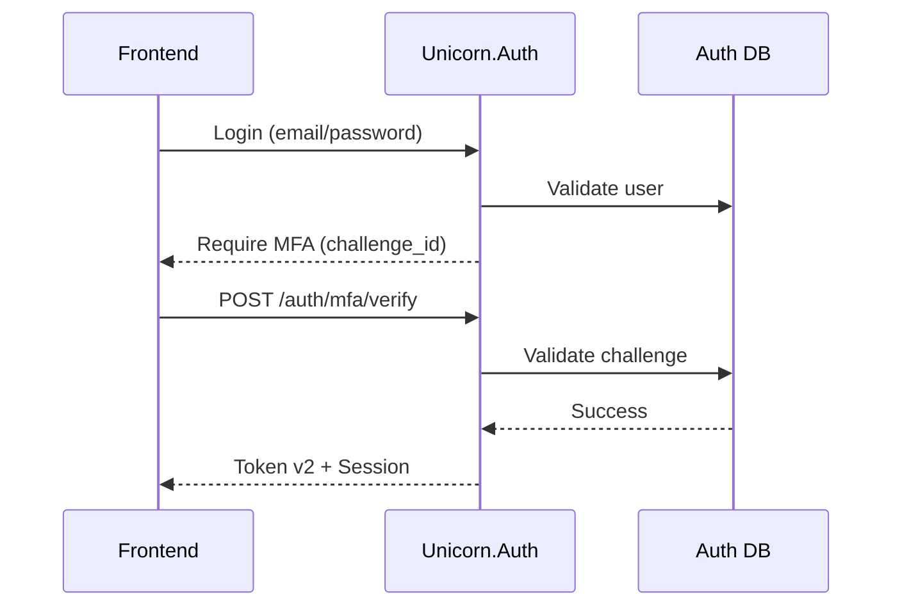
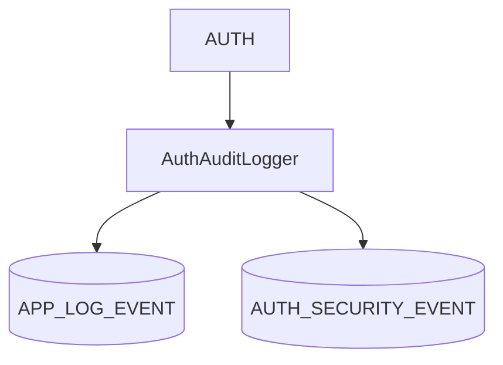
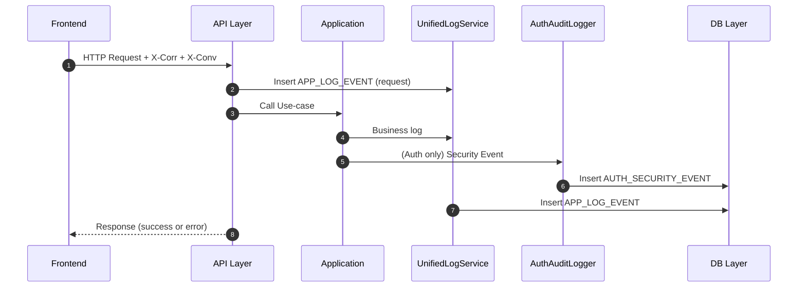
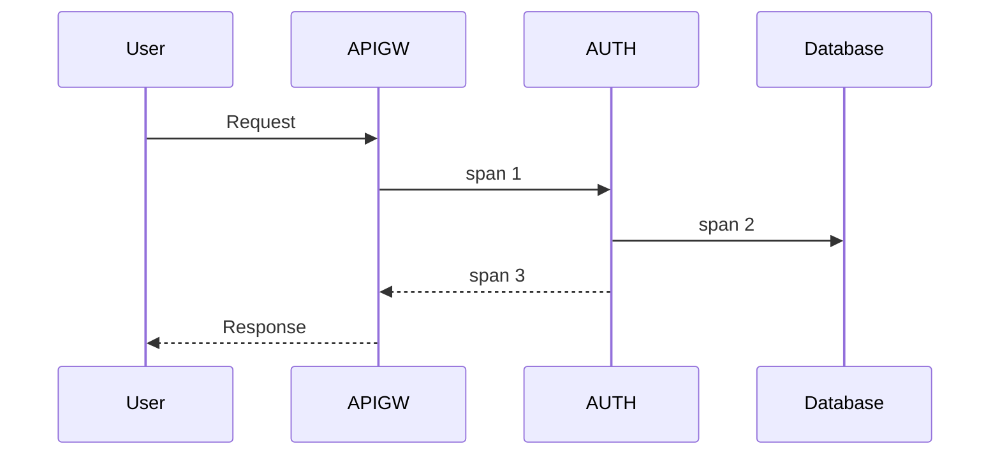

# Unicorn Backend Architecture v1.0  
**บริษัท Unicorn — เอกสารสถาปัตยกรรมระบบ Backend ระดับองค์กร**  
**Hybrid Edition (Diagram + Formal + อ่านง่าย)**  
**Version: 1.0**

---

## Table of Contents

1. บทที่ 1 — บทนำ (Introduction)  
2. บทที่ 2 — หลักสถาปัตยกรรมหลัก (Architecture Principles)  
3. บทที่ 3 — Service Blueprint (ภาพรวมระบบ)  
4. บทที่ 4 — มาตรฐาน API (API Standards)  
5. บทที่ 5 — Security Architecture (Token v2 / MFA v2 / Session Model)  
6. บทที่ 6 — Logging & Observability Architecture  
7. บทที่ 7 — Data & Persistence Architecture  
8. บทที่ 8 — Non-Functional Requirements (NFR)  
9. บทที่ 9 — Development Standards  
10. บทที่ 10 — Architecture v2.0 Roadmap

---

# บทที่ 1 — บทนำ (Introduction)

## 1.1 วัตถุประสงค์ของเอกสาร

เอกสารฉบับนี้จัดทำขึ้นเพื่อเป็น “มาตรฐานสถาปัตยกรรมหลักของ Backend ทั้งบริษัท Unicorn”  
โดยมีเป้าหมายเพื่อกำหนดแนวคิด วิธีการออกแบบ และวิธีการพัฒนาระบบ Backend ทั้งหมดให้เป็นมาตรฐานเดียวกัน

เอกสารนี้จะ:

- บอก **วิธีออกแบบบริการ (Services)** ให้สอดคล้องกัน  
- บอก **โครงสร้างระบบ (Architecture)** สำหรับทุกทีม  
- วาง **มาตรฐาน API / Security / Token / MFA / Data / Logging**  
- วางรากฐานสำหรับ **Unicorn.Auth** ให้เป็น Identity Provider กลาง  
- เตรียมพร้อมระบบทั้งหมดสำหรับ **การเติบโตใน 3–10 ปีข้างหน้า**

---

## 1.2 ขอบเขต

เอกสารนี้ครอบคลุมระบบ Backend ทั้งหมด เช่น:

- Unicorn.Auth (Authentication & Identity Provider)  
- Services อื่น ๆ เช่น Payment, Notification, Workspace, CRM  
- มาตรฐาน API, Token, MFA, Logging, Data, NFR  
- วิธีเขียนโค้ด, โฟลเดอร์, Repository, Stored Procedure  
- มาตรฐาน monitoring & observability

**สิ่งที่ไม่ครอบคลุมใน v1.0**:

- สถาปัตยกรรม Microservices เต็มรูปแบบ (จะอยู่ใน v2.0)  
- CI/CD pipeline เฉพาะบริษัท (มี guideline เท่านั้น)  
- Frontend / Mobile Architecture  

---

## 1.3 เป้าหมายสถาปัตยกรรม (Architecture Goals)

1. **ความสอดคล้อง (Consistency)**  
   ทุกบริการใช้รูปแบบเดียวกัน ลดความสับสนของทีม

2. **ความน่าเชื่อถือ (Reliability)**  
   ระบบไม่ล้ม ไม่ error แบบเดาไม่ได้ มี logging trace ครบทุกชั้น

3. **ความปลอดภัยสูงสุด (Security by Design)**  
   ระบบถูกออกแบบให้ปลอดภัยตั้งแต่โครงสร้าง ไม่ใช่เพิ่มทีหลัง

4. **รองรับการเติบโต (Scalability)**  
   ระบบต้องขยายได้ง่ายเมื่อมีผู้ใช้งานมากขึ้น

5. **ตรวจสอบได้ (Observability)**  
   ทุก request ต้องติดตามย้อนหลังได้ผ่าน Correlation / Conversation

6. **พัฒนาได้ง่าย (Developer Friendly)**  
   โครงสร้างไฟล์ มาตรฐานการเขียน ทำให้ทีมใหม่เข้าใจได้ทันที

7. **พร้อมอนาคต (Future-proof)**  
   รองรับ Token v2, MFA v2, WebAuthn, Distributed Tracing, Event-driven

---

## 1.4 หลักคิดสำคัญของสถาปัตยกรรม (Core Principles)

### **Separation of Concerns**
แยกแต่ละส่วนให้ทำหน้าที่ของตัวเอง เช่น:

- Controller → รับ request  
- Application → orchestrate flow  
- Domain → business rules  
- Repository → เข้าถึงข้อมูล  
- Logging → แยกออกเป็น cross-cutting  

### **Clean Architecture + Hexagonal (Ports & Adapters)**  
เพื่อให้ระบบ test ง่าย เปลี่ยน DB หรือ provider ได้ง่าย

### **Cross-cutting Services แบบรวมศูนย์**  
Logging, Audit, Correlation, Error Handling ต้องใช้ร่วมกันทั้งบริษัท

### **API First Design**  
ทุกบริการต้องออกแบบผ่าน OpenAPI 3.x ก่อน หรือพร้อมกัน

### **Stored Procedure เป็นมาตรฐานกลาง**  
ทุกการเข้าถึงข้อมูลต้องผ่าน SP (เหตุผล: security, audit, performance)

---

## 1.5 คำจำกัดความ

| คำ | ความหมาย |
|-----|-----------|
| **Unicorn.Auth** | ระบบ Authentication กลางของบริษัท |
| **Application Layer** | ชั้นจัดการ use-case เช่น login, refresh, mfa verify |
| **Domain Model** | กติกา/Logic แท้ เช่น password policy, session rules |
| **IUnifiedLogService** | บริการ logging กลางที่ใช้ทุก service |
| **IAuthAuditLogger** | บริการ audit ความปลอดภัย (เฉพาะ Auth) |
| **Correlation Id** | ใช้ trace request หนึ่งครั้งผ่านทุกระบบ |
| **Conversation Id** | ใช้ trace flow หลาย request เช่น login→mfa→token |
| **NFR** | standard ด้านคุณภาพ เช่น ความเร็ว ความปลอดภัย ความเสถียร |

---

# บทที่ 2 — หลักสถาปัตยกรรมหลัก (Architecture Principles)

---

## 2.1 บทนำ

บทนี้คือหัวใจสำคัญของ Unicorn Backend Architecture  
เนื่องจากเป็นชุดของ “กฎสถาปัตยกรรม” ที่ทุกบริการ (Service) ของบริษัทต้องยึดถือ  
ไม่ว่าจะเป็น Auth, Payment, Workspace, Notification, หรือบริการใหม่ที่เพิ่มในอนาคต

เป้าหมายของหลักสถาปัตยกรรมคือ:

- ทำให้ระบบทุกบริการมี Pattern เดียวกัน  
- ปรับปรุงคุณภาพโค้ดทั้งองค์กร  
- ทำให้ระบบเติบโตได้โดยไม่สร้างหนี้ทางเทคนิค  
- ทำให้ onboarding ทีมใหม่ง่าย  
- ทำให้การตรวจสอบปัญหาเร็วขึ้น  
- รองรับการขยายระดับบริการหลายทีมในอนาคต  

---

## 2.2 หลักตัวนำ (Guiding Principles)

### **2.2.1 Separation of Concerns (แยกบทบาท)**  
ทุกส่วนในระบบต้องทำเฉพาะหน้าที่ของตัวเอง เช่น:

- **Controller** → รับ request, validate เบื้องต้น, ส่งต่อไป Application  
- **Application Service** → ประสานขั้นตอนของ use-case  
- **Domain** → กติกาทางธุรกิจ (business rules)  
- **Infrastructure** → ติดต่อ DB / external provider  
- **Cross-cutting** → Logging, Correlation, Error Handling  

ห้ามปะปน logic ข้าม layer โดยไม่จำเป็น

---

### **2.2.2 Clean Architecture (Onion Model)**  
เพื่อให้ระบบ test ง่าย, refactor ง่าย, ขยายได้ยาว 5–10 ปี

```
API → Application → Domain ← Infrastructure (ผ่าน interface)
```

หลักสำคัญ:

- Domain ไม่รู้จัก DB, HTTP, Framework  
- Application ใช้เฉพาะ interface  
- Infrastructure คือ adapter ที่เปลี่ยนโลกจริง → โค้ด  

---

### **2.2.3 Ports & Adapters (Hexagonal Architecture)**  
ทำให้ระบบยืดหยุ่น เปลี่ยน DB หรือ Provider ง่าย

ตัวอย่าง:

```
IAuthUserRepository → SpAuthUserRepository → sp_auth_user
IEmailProvider → SendGridEmailProvider
```

Mermaid diagram:



---

### **2.2.4 Cross-cutting Concerns ต้องรวมศูนย์**

ตัวอย่าง concerns ที่ต้องเป็น service กลาง:

- Logging (UnifiedLogService)  
- Security Audit (AuthAuditLogger)  
- Correlation / Conversation  
- Error Filter  
- Configuration  
- Retry / Circuit Breaker (ในอนาคต)

เหตุผล:

- ลดโค้ดซ้ำ  
- บังคับให้ใช้นโยบายเดียวกันทั้งบริษัท  
- ทำให้ตรวจสอบย้อนหลังง่าย  

---

### **2.2.5 API First Design**

ทุกบริการต้อง:

- มี OpenAPI 3.x ครบถ้วน  
- Update พร้อมกับ code ไม่ให้ drift  
- ใช้เป็น spec ให้ทีม Frontend/QA/devops

API ที่ดีต้อง:

- ใช้ path ที่อ่านง่าย (REST style)  
- ใช้ model response เดียวกันทั้งบริษัท  
- versioning ชัดเจน (`/api/v1/...`)  

---

### **2.2.6 Stored Procedure-Driven Architecture**

Unicorn กำหนดว่า:

**“ทุกการเข้าถึงฐานข้อมูลต้องผ่าน Stored Procedure เท่านั้น”**

เพราะ:

- ปลอดภัยกว่า  
- audit ได้ง่าย  
- ควบคุมสิทธิ์ได้ดี  
- structure คงที่  
- performance ดีกว่า raw query เสมอ  

---

### **2.2.7 Logging / Observability เป็นส่วนหนึ่งของสถาปัตยกรรม**

ทุกบริการต้อง:

- ส่ง log ผ่าน UnifiedLogService  
- มี correlation_id, conversation_id  
- mask ข้อมูลอ่อนไหวเสมอ  
- log ทุก error + business event สำคัญ  
- รองรับ Distributed Tracing (ใน v2.0)

---

### **2.2.8 Fail-Safe & Resilient by Design**

ตัวอย่าง:

- Logging fail → ระบบต้องยังทำงานต่อ  
- External API fail → retry + circuit breaker  
- DB ช้า → degrade gracefully  

---

## 2.3 การแบ่งชั้นเป็น 4 Layers

```mermaid
flowchart TD
    A[API Layer\n(Controller + Filter)] --> B[Application Layer\n(Use-case Service)]
    B --> C[Domain Layer\n(Business Rules)]
    B --> D[Infrastructure Layer\n(SP, DB, External)]
    C --> D
```

### **API Layer**
- รับ request + validate เบื้องต้น  
- ไม่เขียน business logic  

### **Application Layer**
- orchestrate use-case  
- เรียก Domain เพื่อ validate rules  
- เรียก Repository ผ่าน interface  

### **Domain Layer**
- รวบรวมกติกา เช่น password policy, session rules  
- ห้ามรู้จัก DB/HTTP  

### **Infrastructure Layer**
- ติดต่อ DB ผ่าน SP  
- ติดต่อ API ภายนอก  
- encryption / hashing  

---

## 2.4 กฎเหล็กสถาปัตยกรรม Unicorn

1. **Controller ต้องบาง**  
2. **Logic ต้องอยู่ใน Application + Domain**  
3. **Repository ผ่าน interface เท่านั้น**  
4. **ห้าม raw SQL**  
5. **ทุก request/log ต้องมี correlation_id**  
6. **ห้าม log PII**  
7. **ใช้ Token v2 / MFA v2 เท่านั้น**

---

## 2.5 การออกแบบเพื่อรองรับการเติบโต

สถาปัตยกรรมนี้ออกแบบให้รองรับ:

- การเพิ่มบริการใหม่อย่างรวดเร็ว  
- การทำงานหลายทีมพร้อมกัน  
- การ refactor ส่วนต่าง ๆ โดยไม่กระทบกัน  
- การ transition ไปสู่ distributed architecture ใน v2.0  

---

# บทที่ 3 — Service Blueprint (ภาพรวมระบบ Unicorn Backend)

---

## 3.1 บทนำ

Service Blueprint คือภาพรวมของโครงสร้างบริการ (Backend Services) ทั้งหมดในบริษัท Unicorn  
เพื่อให้เห็นชัดเจนว่า:

- แต่ละชั้น (Layer) ทำหน้าที่อะไร  
- แต่ละบริการควรออกแบบอย่างไร  
- ควรแยก logic อย่างไร  
- Logging / Token / Security / Data จะไหลผ่านอย่างไร  
- บริการใหม่ควรพัฒนาในรูปแบบเดียวกันหรือไม่  

Blueprint นี้เป็นแม่แบบกลางของทั้งองค์กร โดยอิงจาก Unicorn.Auth ซึ่งเป็น “Reference Implementation”

---

## 3.2 ภาพรวมสถาปัตยกรรมในระดับสูง (High-Level Architecture)

โครงสร้างบริการทั้งหมดของ Unicorn ใช้รูปแบบ 4-layer architecture  
พร้อม cross-cutting services กลาง

```mermaid
flowchart TD

Client[Frontend / Mobile / External System] --> API[API Layer]

API --> APP[Application Layer\n(Use-case Orchestration)]
APP --> DOMAIN[Domain Layer\n(Business Rules)]
APP --> INFRA[Infrastructure Layer\n(SP / DB / External Providers)]

API --> LOG[Cross-cutting\n(Log, Audit, Correlation)]
APP --> LOG
INFRA --> LOG

INFRA --> DB[(SQL Server / Stored Procedures)]
INFRA --> EXT[External Services / Provider]
```

จุดสำคัญ:

- API → บางที่สุด  
- Application → orchestrate flow  
- Domain → รวมกติกา  
- Infrastructure → ติดต่อ DB ผ่าน SP  
- Log/Audit/Corr → ศูนย์กลางของทั้งบริษัท  

---

## 3.3 โครงสร้างโฟลเดอร์มาตรฐานต่อบริการ (Service Folder Blueprint)

ทุกบริการควรใช้โครงสร้างนี้เหมือน Unicorn.Auth:

```
/src
  /{ServiceName}.Api
    /Controllers
    /Models
      /Requests
      /Responses
      /Domain
    /Services
      /Application
      /Domain
    /Repositories
      /Interfaces
      /Implementations
    /DBManager
    /Logging
    /Middleware
    /Config
    Program.cs

/docs
  /architecture
  /specs

/migrations

/tests
  /Unit
  /Integration
```

เหตุผล:

- รวม logic ที่เกี่ยวข้องกันเป็นกลุ่ม  
- รองรับ Clean Architecture แบบชัดเจน  
- ทำให้ระบบอ่านง่ายกว่าการใช้ structure เบลอ ๆ ที่หลายบริษัทใช้  
- รองรับ scaling ของทีมในอนาคต  

---

## 3.4 บทบาทของแต่ละ Layer

### **3.4.1 API Layer (Controller Layer)**

**บทบาทหลัก:**
- รับและ validate request เบื้องต้น  
- แปลงเป็น DTO ให้ Application Layer  
- ส่ง response ในรูปแบบมาตรฐาน (`success/code/message/data`)  
- เพิ่ม correlation_id และ conversation_id  

**สิ่งที่ห้าม:**
- ห้ามเขียน business logic  
- ห้ามเข้าถึง DB โดยตรง  
- ห้ามเรียก Stored Procedure ใน controller  
- ห้ามเรียก log/audit โดยตรง (ต้องผ่าน UnifiedLogService / AuthAuditLogger)

---

### **3.4.2 Application Layer (Use-case Orchestration)**

**บทบาทหลัก:**
- รวม sequence ของแต่ละ use-case  
- เรียก Domain Model เพื่อตรวจสอบกติกา  
- เรียก Repository ผ่าน interface เท่านั้น  
- เรียก Logging / Audit event  
- ห้ามมี logic ระดับกติกา (ต้องอยู่ใน domain)

ตัวอย่าง flow login:

```
LoginRequest
→ Validate credentials via SP
→ Domain: password policy check
→ Domain: lockout policy
→ Create session (session_id, device_id)
→ Generate Token v2
→ Write AuthAudit Security Event
→ Return TokenSetResponse
```

---

### **3.4.3 Domain Layer (Business Rules)**

**บทบาทหลัก:**
- รวม logic จริงของระบบ  
- เช่น:
  - Password policy  
  - Session policy  
  - MFA flow rules  
  - Token rotation  
  - Account lockout logic  

**สิ่งที่ห้าม:**
- ห้ามเรียก DB  
- ห้ามรู้จัก HTTP  
- ห้ามรู้จัก JSON  
- ห้ามรู้จัก framework เช่น Entity Framework

---

### **3.4.4 Infrastructure Layer (DB / External Provider)**

Infrastructure คือ “Adapter” ของระบบ เช่น:

- DbUtils → SP  
- SpAuthUserRepository → sp_auth_user  
- SpAuthMfaRepository → sp_auth_mfa  
- EmailProvider → SendGrid  
- SmsProvider → Twilio  

**หลักการ:**
- Application ไม่รู้ว่าใช้ DB อะไร  
- Domain ไม่รู้ว่ามี DB ด้วยซ้ำ  
- Repository implement interface ผ่าน SP เท่านั้น

---

## 3.5 การไหลของคำสั่ง (End-to-End Request Flow)

Diagram ต่อไปนี้คือ flow ที่ทุกบริการใน Unicorn จะใช้ ไม่ว่าจะเป็น Auth หรือบริการอื่น:



**ประโยชน์ของโครงสร้างนี้:**
- Debug ง่าย  
- Trace ทุกชั้นใน Log ได้  
- Business logic แยกออกจาก DB  
- Controller บาง ดูแลง่าย  

---

## 3.6 Cross-cutting Architecture (Logging / Audit / Correlation)

ระบบ Unicorn ให้ความสำคัญเป็นพิเศษกับส่วน Cross-Cutting

```mermaid
flowchart TD
API --> C[Cross-Cutting Layer\n(Log, Audit, Correlation)]
APP --> C
INF --> C
C --> DB1[(APP_LOG_EVENT)]
C --> DB2[(AUTH_SECURITY_EVENT)]
```

### มี 3 องค์ประกอบหลัก:

1. **UnifiedLogService**  
   - Log ทุก request / response  
   - Transaction log  
   - Behavior log  
   - System log  

2. **AuthAuditLogger (เฉพาะ Unicorn.Auth)**  
   - Log ความปลอดภัย เช่น login fail, MFA fail, token misuse  

3. **Correlation / Conversation ID**  
   - ควบคุม trace ข้าม FE → BE → DB → External  

---

## 3.7 Service Integration Blueprint (บริการคุยกับ Auth อย่างไร)

ทุก service ภายในบริษัท ต้องผสมกับ Unicorn.Auth ในรูปแบบเดียวกัน:



กฎ:
- ทุก service ใช้ Token v2 จาก Unicorn.Auth  
- ห้ามทำระบบ auth เอง  
- ห้ามมี password storage ใน service อื่น  
- ต้องตรวจ token ในทุก request  

---

## 3.8 ตัวอย่างการออกแบบบริการใหม่ตาม Blueprint

ตัวอย่างบริการ “Workspace Service”:

```
WorkspaceController
  → WorkspaceService (Application)
      → WorkspaceDomain (Business rules)
      → WorkspaceRepository (SP)
  → UnifiedLogService
  → Authorization via Token v2
```

ระบบนี้จะ:

- ตรวจสอบ token ผ่าน Unicorn.Auth  
- Log ทุก action ผ่าน UnifiedLogService  
- ใช้ SP เช่น `sp_workspace`  
- แยก domain rules เช่น workspace ownership check  

---

## 3.9 Blueprint Summary (สรุปย่อ)

```
[Controller]
  → thin, validate, forward

[Application]
  → orchestrate use-case

[Domain]
  → business rules, policies

[Infrastructure]
  → DB/SP, Email, SMS

[Cross-cutting]
  → log, audit, correlation, error
```

ภาพรวม:

- ชัดเจน  
- ง่ายต่อการพัฒนา  
- ง่ายต่อการตรวจสอบ  
- รองรับ Token v2 / MFA v2  
- รองรับ Observability v2  
- รองรับการขยายเป็น distributed ใน v2.0

---

# บทที่ 4 — มาตรฐานการออกแบบ API (API Standards)

---

## 4.1 บทนำ

API คือ “ภาษากลาง” ที่ Frontend, Mobile, ระบบภายใน และระบบภายนอก ใช้สื่อสารกับบริการ Backend ของบริษัท Unicorn  
ดังนั้น API ที่ดีต้อง:

- มีมาตรฐานเดียวกันทั้งองค์กร  
- อ่านง่าย  
- สื่อความหมายชัดเจน  
- มีความสอดคล้องกันทุก Service  
- ดูแลรักษาง่าย  
- รองรับการเติบโตของฟีเจอร์  
- ปลอดภัย และตรวจสอบย้อนหลังได้  

บทนี้กำหนด API Standards ที่ใช้ทั้งบริษัท Unicorn และเป็น foundation ของ Unicorn.Auth

---

## 4.2 API Design Principles

### 1) **Simple and Predictable**  
Path, naming, request, response ต้องสื่อความหมายตรงไปตรงมา

### 2) **Uniformity (ความสม่ำเสมอ)**
ทุก service ต้องใช้รูปแบบเดียวกัน เช่น:

- `/api/v1/...`
- Response format เดียวกันทุก endpoint  

### 3) **Client-friendly**
API ต้องออกแบบตามวิธีใช้งานของ FE ไม่ใช่ตามวิธีเก็บใน DB

### 4) **Backward Compatible**
ไม่ทำให้บริการอื่นหรือ FE พังเมื่ออยากเพิ่มฟีเจอร์ใหม่

### 5) **Security Embedded**
รวม token validation + input validation + masking + rate limit

---

## 4.3 RESTful Standards

Unicorn ใช้ RESTful เป็นมาตรฐานหลักของ API

### HTTP Methods ใช้แบบนี้:

| Method | ความหมาย | ตัวอย่าง |
|--------|-----------|----------|
| **GET** | ดึงข้อมูล | `/users/123` |
| **POST** | สร้าง / ดำเนิน action | `/auth/login` |
| **PUT** | update ทั้ง object | `/users/123` |
| **PATCH** | update บางส่วน | `/users/123/display-name` |
| **DELETE** | ลบข้อมูล | `/sessions/12` |

---

## 4.4 Naming Standards

### 4.4.1 Path ชื่อเป็น lowercase ทั้งหมด
❌ `/GetUserInfo`  
✔ `/api/v1/users/{id}`

### 4.4.2 ใช้คำพหูพจน์ (plural)
✔ `/users`  
✔ `/sessions`

### 4.4.3 ไม่ใช้คำกริยานำหน้า  
❌ `/doLogin`  
✔ `/auth/login`

### 4.4.4 Avoid DB-driven API  
❌ `/auth_user/get_by_id`  
✔ `/users/{id}`

---

## 4.5 API Versioning

ใช้รูปแบบ:

```
/api/v1/...
```

หลักการ:

- เริ่มที่ `v1` เสมอ  
- เมื่อเกิด breaking change → เพิ่ม `/api/v2/...`  
- ไม่ใช้ version ใน header  

---

## 4.6 Request / Response Standards

### 4.6.1 Request Body (JSON)
- ใช้ camelCase  
- ไม่ส่งข้อมูลมากเกินไป  
- ทุก Input ต้อง validate

ตัวอย่างที่ดี:

```json
{
  "email": "user@example.com",
  "password": "abc12345"
}
```

---

## 4.6.2 Response Format (มาตรฐาน Unicorn ทุกระบบ)

โครงสร้าง Response ต้องเป็นแบบเดียวกัน:

```json
{
  "success": true,
  "code": 0,
  "message": "OK",
  "data": {},
  "errors": null
}
```

**เหตุผล:**  
เพื่อให้ Frontend/QA/Logging ใช้รูปแบบเดียวกันในทุกบริการ

---

## 4.7 Error Model (Error Taxonomy)

ทุกบริการต้องใช้ Error Model ชุดเดียวกัน:

| Error Type | HTTP | ความหมาย |
|-----------|------|----------|
| ValidationError | 400 | input format ผิด |
| BusinessRuleError | 400 | ผิดกติกาธุรกิจ |
| AuthenticationError | 401 | token/password ผิด |
| AuthorizationError | 403 | ไม่มีสิทธิ์ |
| NotFound | 404 | ไม่พบข้อมูล |
| Conflict | 409 | email/รหัสซ้ำ |
| SystemError | 500 | error ฝั่ง server |

ตัวอย่าง Error:

```json
{
  "success": false,
  "code": 4001,
  "message": "ข้อมูลไม่ถูกต้อง",
  "errors": [
    { "field": "email", "message": "รูปแบบอีเมลไม่ถูกต้อง" }
  ]
}
```

---

## 4.8 Required Headers (ทุกบริการต้องรองรับ)

| Header | ความหมาย |
|--------|----------|
| **X-Correlation-Id** | trace request เดียว |
| **X-Conversation-Id** | trace flow ยาวหลายขั้นตอน |
| **Authorization** | Bearer Token v2 |
| **User-Agent** | identify client |

ถ้า FE ไม่ส่ง correlation → BE ต้อง generate ให้ทันที

---

## 4.9 Pagination, Filtering, Sorting

### Request:
```
GET /api/v1/users?page=1&pageSize=20&sortBy=created_at&order=desc
```

### Response:
```json
{
  "success": true,
  "data": {
    "items": [],
    "pagination": {
      "page": 1,
      "pageSize": 20,
      "totalItems": 200,
      "totalPages": 10
    }
  }
}
```

---

## 4.10 API + Logging Integration

ทุก API endpoint ต้องเรียก UnifiedLogService

Flow:



ส่วน Auth service ต้อง log ลง AUTH_SECURITY_EVENT ด้วย

---

## 4.11 API Authentication Standards

ทุกบริการต้องยืนยันตัวตนด้วย Token v2 จาก Unicorn.Auth:

- Access Token → อายุสั้น  
- Refresh Token → ผูกกับ session/device  
- ตรวจสอบใน controller ผ่าน middleware  
- ห้ามทำระบบ login ของ service ใด ๆ เอง  

---

## 4.12 API Checklist ก่อน Merge PR

### ชุดตรวจสอบ:

- [ ] มี OpenAPI ครบ  
- [ ] มี versioning `/api/v1/...`  
- [ ] Response format มาตรฐาน  
- [ ] Error Type ถูกต้อง  
- [ ] ไม่ log PII  
- [ ] Controller บาง ไม่เกิน 150 บรรทัด  
- [ ] ใช้ application service แทนเขียน logic ใน controller  
- [ ] ใช้ repository ผ่าน interface  
- [ ] มี correlation/conversation id  
- [ ] input validated เสมอ  

---

## 4.13 บทสรุป

API Standards นี้เป็น “ภาษากลาง” ของระบบ Unicorn  
บริการทั้งหมดต้องยึดตามมาตรฐานนี้เพื่อ:

- ลดการสื่อสารผิดพลาด  
- ลดภาระของ Frontend  
- ปรับปรุงความเร็ว dev  
- ทำระบบง่ายต่อการตรวจสอบ  
- รองรับความปลอดภัย Token v2 / MFA v2  
- เตรียมระบบสู่ distributed architecture ใน v2.0  

---

# บทที่ 5 — Security Architecture  
(Token v2, MFA v2, Session Model, Zero-trust Core)

---

## 5.1 บทนำ

Security Architecture คือ “แกนกลางของความปลอดภัยทั้งระบบ Unicorn”  
และเป็นหนึ่งในส่วนที่มีผลต่อ:

- ความปลอดภัยของข้อมูลผู้ใช้  
- ความน่าเชื่อถือของบริษัท  
- ความสามารถในการตรวจสอบย้อนหลัง (forensic)  
- การป้องกันภัยคุกคาม  
- การรองรับระบบภายนอก (integration)  
- การขยายระบบสู่อนาคต (v2.0 / distributed)  

มาตรฐานในบทนี้ครอบคลุม:

- Token v2 Architecture  
- MFA v2 Architecture  
- Session Model  
- Zero-trust Security Foundation  
- Security Event Logging  
- Device Binding / Session Risk Engine  

---

## 5.2 หลักการความปลอดภัยระดับองค์กร (Security Principles)

### **1) Zero Trust**  
ทุก request ต้องตรวจสอบเสมอ ไม่เชื่อมต่อโดยอัตโนมัติ  
ไม่ว่า request มาจาก FE หรือบริการภายใน

### **2) Defense-in-Depth (ป้องกันหลายชั้น)**  
Login → MFA → Token → Session → Audit → Anomaly detection

### **3) Least Privilege**  
- DB account ใช้สิทธิ์เฉพาะ SP ที่ต้องการ  
- Token มี scope ตามสิทธิ์เท่านั้น  
- ไม่ให้ access table ตรง ๆ

### **4) Fail Secure**  
ถ้าระบบมีปัญหา → เลือกทางที่ปลอดภัยที่สุดก่อน เช่น:

- บังคับ MFA ใหม่  
- ยกเลิก session  
- ปิด refresh token  

### **5) Security by Design**  
ระบบ Auth ต้องถูกออกแบบให้ปลอดภัยตั้งแต่ต้น ไม่ใช่เพิ่มทีหลัง

---

## 5.3 Token v2 Architecture

Token v2 คือรุ่นถัดไปที่ออกแบบมาแก้ปัญหาของ JWT รุ่นแรก  
และออกแบบตามหลัก zero-trust

### 5.3.1 โครงสร้าง Token v2

**Access Token**  
- อายุสั้นมาก (15–30 นาที)  
- ลงนามด้วย RSA/ECDSA  
- ไม่มี refresh token ฝังอยู่  

**Refresh Token**  
- สร้างแบบ 256-bit random  
- เก็บแบบ hashed ฝั่ง server  
- ผูกกับ session เท่านั้น (session-bound)  
- ใช้ได้ครั้งเดียว (single-use with rotation)  

**Session Id**  
- ตัวระบุอุปกรณ์หนึ่งชิ้น  
- เปลี่ยนทุกครั้ง refresh  

**Device Id**  
- hash ของ fingerprint จาก FE  
- ไม่เก็บ PII  

---

## 5.3.2 Token v2 High-level Flow



---

## 5.3.3 Token v2 คุณสมบัติสำคัญ

- **Session binding**: refresh token ใช้ได้กับ session เดิมเท่านั้น  
- **Device binding**: ผูก token กับ device id  
- **Silent rotation**: refresh token หมดอายุ → ออกคู่ใหม่  
- **Replay attack detection**: ใช้ refresh token ซ้ำ → block ทันที  
- **Stolen token protection**: token ที่ถูกขโมยใช้ไม่ได้โดย design  

---

## 5.4 Session Model

Session Model คือพื้นฐานของ Token v2

```
AUTH_SESSION
- session_id
- user_id
- device_id
- user_agent (masked)
- ip_address (masked)
- created_at
- last_seen_at
- is_revoked
- risk_level
```

### หลักการ:

- 1 session = 1 device  
- ใช้ token จาก device อื่น → block  
- session จะ rotate ทุก refresh  
- มี risk scoring สำหรับ session ที่ผิดปกติ  

---

## 5.5 MFA v2 Architecture

ออกแบบมาเพื่อ:

- ปลอดภัยกว่า MFA v1  
- ขยายได้ง่าย  
- รองรับหลายช่องทาง  
- รองรับ Risk-based MFA ในอนาคต  

### 5.5.1 ประเภท MFA ที่รองรับ

- Email OTP  
- SMS OTP  
- TOTP  
- Backup Codes  
- (รองรับ: Push Notification / WebAuthn ในอนาคต)

---

## 5.5.2 โครงสร้าง Data ของ MFA v2

```
AUTH_MFA_METHOD
- method_id
- user_id
- method_type
- identifier_value_masked
- secret_data (encrypted)
- enabled
```

```
AUTH_MFA_CHALLENGE
- challenge_id
- user_id
- method_type
- retry_count
- challenge_status
- expire_at
```

---

## 5.5.3 Flow ของ MFA v2



---

## 5.6 Security Event Logging (AUTH_SECURITY_EVENT)

ตารางนี้เป็น “หัวใจของ forensic” สำหรับการสืบเหตุการณ์ต่าง ๆ เช่น:

- Login fail  
- MFA fail  
- Token replay  
- unusual device login  
- suspicious refresh token  

โครงสร้าง (Hybrid Simplified):

```
AUTH_SECURITY_EVENT
- event_type
- result
- reason_code
- user_id
- session_id
- device_id
- mfa_method
- ip_address (masked)
- user_agent (masked)
- correlation_id
- conversation_id
- risk_level
- created_at
```

เหตุการณ์เหล่านี้ต้องถูกบันทึกเสมอ

---

## 5.7 Zero-Trust สิ่งที่ต้อง enforce ในทุกบริการ

1. ทุก request ต้องตรวจ token  
2. ทุก service ใช้ Unicorn.Auth ในการ verify token  
3. ห้ามสร้างระบบ auth แยกเอง  
4. ห้ามมี password storage ใน service อื่น  
5. ทุก service ต้อง log กับ UnifiedLogService  
6. ทุกบริการต้อง propagate correlation_id  
7. ทุก user action ต้อง trace ได้ผ่าน log  

---

## 5.8 Device Binding (พื้นฐานของ Zero-trust)

Device Id ถูกสร้างจาก FE เช่น:

- hashed fingerprint  
- hashed UA  
- hashed platform  

ข้อสำคัญ:

- Server เก็บเฉพาะ hash ไม่เก็บข้อมูลจริง  
- เทียบ device สำหรับ refresh token  
- ใช้ประกอบ risk score  

---

## 5.9 Risk Engine (พื้นฐานของ v2.0)

ในภาพรวม Risk Engine จะจัดระดับความเสี่ยงของแต่ละ session:

- ปกติ  
- น่าสงสัย (suspicious)  
- เสี่ยงสูง (high risk)  

จากปัจจัย:

- ความผิดปกติของ token refresh  
- login จาก device ใหม่  
- retry MFA ผิดหลายครั้ง  
- pattern พฤติกรรมผิดปกติ  

---

## 5.10 Security Checklist สำหรับทุกบริการ

- [ ] ตรวจ token ผ่าน middleware  
- [ ] ใช้ Token v2 เท่านั้น  
- [ ] MFA v2 สำหรับ action ที่เสี่ยง  
- [ ] Mask PII ทุกจุด  
- [ ] ใช้ UnifiedLogService  
- [ ] ใช้ AuthAuditLogger สำหรับ event สำคัญ  
- [ ] ใช้ SP เท่านั้นในการเข้าถึงข้อมูล  
- [ ] ตรวจสอบ correlation_id  
- [ ] ไม่เปิดเผยข้อมูลระบบใน error  
- [ ] ไม่ log sensitive data  

---

## 5.11 บทสรุป

Security Architecture นี้คือฐานความปลอดภัยของ Unicorn ทั้งระบบ  
ออกแบบตามหลัก Zero-trust และรองรับอนาคต เช่น WebAuthn, Risk Engine, Device graph  
และเป็นพื้นฐานของ Token v2 / MFA v2 / Security Logging ในทุกบริการ

---

# บทที่ 6 — Logging & Observability Architecture  
(APP_LOG_EVENT, AUTH_SECURITY_EVENT, Correlation, Conversation, UnifiedLogService)

---

## 6.1 บทนำ

Logging & Observability คือ “ระบบประสาทกลาง” ของ Infrastructure บริษัท Unicorn  
เป็นพื้นฐานที่ทำให้บริษัท:

- ตรวจสอบเหตุการณ์ย้อนหลังได้ (Forensic)  
- แก้ไขปัญหาได้รวดเร็ว  
- ป้องกันความผิดปกติได้ทันเวลา  
- วิเคราะห์ปัญหาเชิงสถาปัตยกรรมได้  
- ติดตาม flow ของผู้ใช้ได้ทั้งระบบ  
- สร้างระบบที่น่าเชื่อถือระดับองค์กร  
- รองรับ Distributed Tracing ใน v2.0  

ระบบ Logging ของ Unicorn ต้องเป็น **Unified Model**  
เพื่อให้บริการทั้งหมด (Auth + Backend Services อื่น ๆ) ใช้โครงสร้างเดียวกัน

---

## 6.2 หลักการออกแบบ Logging

### 6.2.1 Log ต้องอ่านรู้เรื่อง  
ข้อความต้องอธิบายเหตุการณ์ชัดเจน ไม่คลุมเครือ เช่น:

- ❌ `"error occurred"`  
- ✔ `"MFA verification failed: challenge expired"`

### 6.2.2 ห้ามเก็บ PII 
ทุกข้อมูลผู้ใช้ที่มีความอ่อนไหวต้องถูก mask เช่น:

- email → `"j***@gmail.com"`  
- phone → `"08x-xxx-xxxx"`  
- ip → `"10.0.x.x"`  
- userAgent → `"Chrome/xxx"` (ไม่เก็บ OS version)

### 6.2.3 Logging ต้องไม่ทำให้ business ล้ม  
ถ้า insert log fail → ระบบยังต้องประมวลผลต่อ

### 6.2.4 ข้อมูลใน Log ต้องมีประโยชน์จริง  
ไม่ log noise  
ไม่ log debug ที่ไม่ช่วยทีม

---

## 6.3 ประเภท Log ในระบบ Unicorn

Unicorn ใช้ 3 ประเภทหลัก:

### 1) Application Log → **APP_LOG_EVENT**  
สำหรับทุก service  
ใช้ unified structure  
บันทึก event เช่น:

- Request received  
- Response returned  
- Business event  
- Integration call  
- Error event  
- Performance data (optional)  

---

### 2) Security Log → **AUTH_SECURITY_EVENT**  
ใช้เฉพาะ Unicorn.Auth  
บันทึกเหตุการณ์สำคัญด้านความปลอดภัย เช่น:

- Login success/fail  
- MFA success/fail  
- Token refresh  
- Token misuse  
- Session revoke  
- Suspicious device  
- Suspicious IP  

---

### 3) System Log  
สำหรับ DevOps  
รวม error จาก infra เช่น:

- DB connection error  
- Timeout  
- Service degradation  

---

## 6.4 UnifiedLogService

UnifiedLogService คือตัวกลางของ logging ที่ทุกบริการต้องใช้

โครงสร้าง:

```
UnifiedLogService
  → InsertAppLogAsync
  → InsertErrorLogAsync
  → InsertBusinessLogAsync
```

ข้อดี:

- ลดการเขียน log ซ้ำใน controller  
- enforce โครงสร้างเดียวกันทั้งองค์กร  
- บังคับใช้ correlation/conversation id  
- รองรับ extension เช่น metrics, tracing

---

## 6.5 AuthAuditLogger (เฉพาะ Unicorn.Auth)

AuthAuditLogger ใช้สำหรับ:

- LoginSuccess / LoginFail  
- MFA Success / MFA Fail  
- TokenRefresh  
- TokenReuseDetected  
- SuspiciousLogin  

Flow:



ข้อดี:

- เก็บข้อมูลความปลอดภัยแยกจาก business log  
- ใช้สำหรับ SIEM / Security dashboard  

---

## 6.6 โครงสร้าง APP_LOG_EVENT

โครงสร้างแบบ Hybrid Simplified:

```
APP_LOG_EVENT
- log_id
- created_at_utc
- timestamp_utc
- level
- category
- event_name
- message
- payload_json (masked)
- source_system
- environment
- correlation_id
- conversation_id
- client_ip (masked)
- user_agent (masked)
```

รายละเอียดสำคัญ:

- `level`: INFO / ERROR / SECURITY  
- `payload_json` ต้อง mask PII ก่อนเสมอ

---

## 6.7 โครงสร้าง AUTH_SECURITY_EVENT

```
AUTH_SECURITY_EVENT
- id
- log_id (FK → APP_LOG_EVENT)
- event_type
- result (SUCCESS/FAIL/BLOCKED)
- reason_code
- user_id
- session_id
- device_id
- identifier_type
- identifier_value_masked
- mfa_method
- ip_address (masked)
- user_agent (masked)
- correlation_id
- conversation_id
- risk_level
- created_at
```

ใช้ในการสอบสวนเหตุการณ์และตรวจสอบการโจมตี

---

## 6.8 Correlation Id vs Conversation Id  

สองค่าที่ Unicorn ใช้เป็นมาตรฐานกลางทั้งบริษัท

### **Correlation Id**
- ระบุ “request เดียว”  
- FE → BE → DB → external  
- ต้องมีในทุก log ทุก event  

### **Conversation Id**
- ระบุ “flow ยาวหลาย request” เช่น:
  - Login → MFA → Token Refresh  
  - Payment → Confirm → Notify  

Frontend เป็นผู้สร้าง Conversation Id  
BE เป็นผู้ propagate ไปทุกชั้นของระบบ

---

## 6.9 Logging Flow ระดับองค์กร



จุดเด่น:

- ทุกขั้นตอน trace ได้ด้วย correlation id  
- Security log แยกจาก business log  
- Logging fail ไม่ทำให้ business ล้ม  

---

## 6.10 Error Logging

Error ต้องถูก log ในรูปแบบ:

- ErrorType (จาก Error Taxonomy)  
- Correlation Id  
- User Id (เฉพาะ masked หรือ encrypted id)  
- Message ปลอดภัย (ไม่บอกข้อมูลระบบ)  
- Stack trace (เฉพาะ INTERNAL log)

ตัวอย่าง:

```json
{
  "level": "ERROR",
  "event_name": "AUTH:MFA_VERIFY_FAIL",
  "message": "MFA verification failed",
  "correlation_id": "abc-123",
  "payload_json": {
    "challenge_id": "xxxx",
    "reason": "expired"
  }
}
```

---

## 6.11 Observability v2 (Roadmap)

ในอนาคต Unicorn จะเพิ่ม:

### 1) Distributed Tracing (OpenTelemetry)
- traceId  
- spanId  
- latency  
- error stack  

### 2) Metrics  
- RPS  
- p50/p95/p99 latency  
- error_rate  
- token_refresh_rate  
- MFA success/failure stats  

### 3) Security Dashboard  
- login fail heatmap  
- suspicious device behavior  
- token misuse detection  

---

## 6.12 Logging Checklist

- [ ] ใช้ UnifiedLogService  
- [ ] Auth ใช้ AuthAuditLogger  
- [ ] ทุก request มี correlation_id / conversation_id  
- [ ] Mask PII ก่อน log  
- [ ] มี error type ตาม taxonomy  
- [ ] controller ไม่มีการสร้าง log ด้วยตัวเอง  
- [ ] logging ไม่ทำให้ request fail  
- [ ] log payload ขนาดเล็ก (ไม่ควรเกิน 5 KB)  

---

## 6.13 บทสรุป

Logging & Observability Architecture ของ Unicorn ถูกออกแบบให้:

- ตรวจสอบย้อนหลังง่าย  
- ปลอดภัยตามหลัก Zero-trust  
- ขยายไปเป็น distributed architecture ใน v2.0 ได้  
- ทำให้ทั้งบริษัทมีมาตรฐาน logging เดียวกัน  
- ใช้เป็นรากฐานของ Security Event Analytics  
- รองรับการตรวจสอบจากทีม Support / DevOps / Security  

Blueprint นี้เป็นโครงสร้างที่แข็งแกร่งและปรับตัวได้ในอนาคต 5–10 ปี

---

# บทที่ 7 — Data & Persistence Architecture  
(Stored Procedures, Repository Pattern, Data Security, Performance)

---

## 7.1 บทนำ

Data & Persistence Architecture คือหัวใจสำคัญของระบบ Unicorn  
เพราะทุกบริการในบริษัทต้องเข้าถึงข้อมูล ผู้ใช้, Session, MFA, Token, Log, Business Data  
ผ่าน Database Layer ที่ปลอดภัยและมีมาตรฐานเดียวกัน

แนวทางนี้ถูกออกแบบให้:

- ปลอดภัยสูง (Least Privilege + Stored Procedure Only)  
- ควบคุมได้ (Auditable)  
- เสถียร (Transaction-safe)  
- ตรวจสอบง่าย (Logging + Correlation)  
- ใช้งานร่วมกันทุกบริการ  
- รองรับการเติบโต (Scalable)  
- ไม่สร้างหนี้ทางเทคนิค  

---

## 7.2 หลักการออกแบบ Data Architecture ของ Unicorn

### 1) Stored Procedure-First (SP Only)  
ทุกการเข้าถึงข้อมูลต้องทำผ่าน Stored Procedure  
เพราะ:

- ปลอดภัยกว่า Raw SQL  
- Audit ได้  
- Performance ดีกว่าใน workload ของ Unicorn  
- บังคับ logic ให้บริการต่าง ๆ ทำงานเหมือนกัน  
- ควบคุม schema เปลี่ยนแปลงง่าย  
- แยก business logic และ DB logic ชัดเจน  

---

### 2) Repository Pattern  
ทุกบริการต้องเข้าถึง DB ผ่าน Interface → Implementation

```
IAuthUserRepository
  → SpAuthUserRepository
     → sp_auth_user
```

ข้อดี:

- เปลี่ยน backend DB ง่าย  
- เขียน Unit Test ง่าย  
- Code อ่านง่าย  
- Layer แยกกันชัดเจน  

---

### 3) Naming Convention & Column Standard  
Unicorn ใช้มาตรฐานร่วมกันทุกบริการ:

| ชนิด | มาตรฐาน |
|------|----------|
| Primary Key | `BIGINT IDENTITY(1,1)` |
| Timestamp | `DATETIME2(3)_utc` |
| Boolean | BIT |
| Identifier | `NVARCHAR(255)` masked |
| JSON | NVARCHAR(MAX) |
| Column Name | lowercase + underscore |

ตัวอย่าง:

```
user_id
created_at_utc
updated_at_utc
session_id
device_id
```

---

### 4) Data Security by Design  
ข้อมูลต่อไปนี้ต้องถูกเข้ารหัส (encrypted):

- password_hash  
- mfa_secret  
- refresh_token_hash  
- backup_codes  
- device_secret  

ข้อมูลต่อไปนี้ต้อง mask:

- email  
- phone  
- ip  
- user agent  

---

### 5) Data Consistency  
- ทุก update/insert/delete ต้องผ่าน SP  
- DB ไม่ควรรวม Business Logic  
- Application เป็นผู้กำหนด Transaction Boundary  

---

## 7.3 ตารางข้อมูลหลัก (Core Tables)

ชุดตารางที่ถือเป็น “มาตรฐานองค์กร Unicorn” เช่น:

### 7.3.1 AUTH_USER

```
AUTH_USER
- user_id (PK)
- login_id
- password_hash
- display_name
- status
- created_at_utc
- updated_at_utc
```

### 7.3.2 AUTH_SESSION (Session Model)

```
AUTH_SESSION
- session_id (PK)
- user_id
- device_id
- user_agent_masked
- ip_address_masked
- refresh_token_hash
- created_at_utc
- last_seen_at_utc
- is_revoked
- risk_level
```

### 7.3.3 AUTH_MFA_METHOD / AUTH_MFA_CHALLENGE  
รองรับทุกประเภท MFA v2

### 7.3.4 ALERT_LOG_EVENT (APP_LOG_EVENT)  
Unified logging table

### 7.3.5 AUTH_SECURITY_EVENT  
Security event log ระดับองค์กร

---

## 7.4 ตาราง Logging ระดับองค์กร

### 7.4.1 APP_LOG_EVENT

```
APP_LOG_EVENT
- log_id
- level
- category
- event_name
- message
- payload_json
- source_system
- environment
- client_ip (masked)
- user_agent (masked)
- correlation_id
- conversation_id
- created_at_utc
```

### 7.4.2 AUTH_SECURITY_EVENT  
เชื่อมต่อกับ APP_LOG_EVENT:

```
AUTH_SECURITY_EVENT
- id
- log_id (FK)
- event_type
- result
- reason_code
- user_id
- session_id
- device_id
- identifier_type
- identifier_value_masked
- mfa_method
- correlation_id
- conversation_id
- risk_level
- created_at
```

---

## 7.5 SP Standards (Stored Procedure Design)

SP ทุกตัวต้องใช้รูปแบบ:

```
CREATE PROCEDURE sp_xxx
    @action NVARCHAR(50),
    @user_id BIGINT = NULL,
    ...
AS
BEGIN
    SET NOCOUNT ON;

    IF @action = 'GET_BY_ID'
    BEGIN
        SELECT ...
        RETURN;
    END

    IF @action = 'CREATE'
    BEGIN
        INSERT ...
        SELECT SCOPE_IDENTITY() AS id;
        RETURN;
    END
END
```

### ข้อดี:

- รวม logic DB ไว้ในจุดเดียว  
- ง่ายต่อการดูแล  
- ลดจำนวน SP  
- audit การเปลี่ยนแปลงง่ายมาก  

---

## 7.6 Repository Pattern (Implementation)

ตัวอย่าง Repository เรียก SP ผ่าน DbUtils:

```csharp
var dt = await _dbUtils.ExecSpToDataTableAsync(
    "sp_auth_user",
    P("@action", "GET_PROFILE"),
    P("@user_id", userId)
);

return dt.MapTo<AuthUserProfileDto>();
```

---

## 7.7 Transaction Boundary

### **Transaction ต้องอยู่ใน Application Layer เสมอ**

ตัวอย่างที่ดี:

```csharp
using var tx = new TransactionScope(TransactionScopeAsyncFlowOption.Enabled);

await _userRepo.UpdateAsync(user);
await _logRepo.InsertAsync(log);

tx.Complete();
```

ตัวอย่างที่ผิด:

- เปิด transaction ใน controller  
- เปิด transaction ใน repository  
- เปิด transaction ใน SP

---

## 7.8 Indexing Strategy

Unicorn กำหนด index ตาม usage จริง:

| Table | Index |
|-------|--------|
| AUTH_USER | IX_AUTH_USER_LOGIN_ID |
| AUTH_SESSION | IX_AUTH_SESSION_USER_ID |
| AUTH_SECURITY_EVENT | IX_AUTH_SECURITY_EVENT_USER_ID |
| APP_LOG_EVENT | IX_APP_LOG_EVENT_CORRELATION_ID |

หลักการ:  
ให้ index ช่วย query ที่ใช้บ่อยที่สุด ไม่ใช่ index ตาม intuition  

---

## 7.9 Data Migration Standards

Migration ต้อง:

- เป็น versioned file  
- idempotent  
- safe rerun  
- rollback ได้  
- code review ก่อน merge  

โครงสร้าง:

```
/migrations
  20250101_init_auth_tables.sql
  20250103_add_mfa_v2.sql
  20250105_add_security_event.sql
```

---

## 7.10 Data Access Policy (Least Privilege)

### ทุกบริการต้องมี DB account แยกกัน  
สิทธิ์อนุญาตเฉพาะ “Execute SP” เท่านั้น  
ห้ามมี “Select / Insert / Update / Delete table”

สิ่งนี้ทำให้:

- ถ้า service ถูก hack → DB ยังปลอดภัย  
- Audit ง่าย  
- ลด blast radius  

---

## 7.11 Data Checklist

- [ ] ใช้ SP เท่านั้น  
- [ ] ใช้ Repository interface  
- [ ] Mask PII  
- [ ] Encrypt sensitive data  
- [ ] Index ครบ  
- [ ] ใช้ timestamp UTC  
- [ ] ไม่มี raw SQL  
- [ ] Transaction อยู่ใน Application  
- [ ] Response จาก DB = DataTable or strongly-typed  

---

## 7.12 บทสรุป

Data & Persistence Architecture ของ Unicorn ถูกออกแบบสำหรับ:

- ความปลอดภัยสูงสุด  
- ความเสถียร  
- ความสอดคล้องกันทุกบริการ  
- ตรวจสอบง่าย  
- รองรับ Token v2 / MFA v2 / Session Model  
- พร้อมพัฒนาเป็น distributed data architecture ในอนาคต  

Blueprint นี้เป็นมาตรฐานกลางของบริษัท  
ทุกบริการต้องใช้โครงสร้างนี้เพื่อให้ระบบเติบโตได้อย่างมั่นคงในอีก 5–10 ปี

---

# บทที่ 8 — Non-Functional Requirements (NFR)  
(Performance, Scalability, Availability, Security, Observability)

---

## 8.1 บทนำ

Non-Functional Requirements (NFR) คือข้อกำหนดด้านคุณภาพ (Quality Attributes)  
ที่กำหนด “วิธีที่ระบบควรทำงาน” ไม่ใช่ “ฟีเจอร์ที่ระบบทำได้”

NFR ของ Unicorn ถูกออกแบบให้เป็นมาตรฐานกลางของทุกบริการ เพื่อให้:

- คงคุณภาพเดียวกันทั้งองค์กร  
- สร้างระบบที่เชื่อถือได้ (Reliable)  
- ระบบเติบโตได้ (Scalable)  
- ปลอดภัยจริง (Security-by-design)  
- Debug ง่าย (Observable)  
- ใช้ทรัพยากรอย่างมีประสิทธิภาพ  

---

## 8.2 กลุ่มของ NFR ใน Unicorn

1. **Performance**  
2. **Scalability**  
3. **Availability**  
4. **Reliability / Consistency**  
5. **Security**  
6. **Maintainability**  
7. **Observability**  
8. **Data Integrity**  
9. **Compatibility & Versioning**  
10. **Resilience / Fault Tolerance**  

---

# 8.3 Performance Requirements

### 8.3.1 Latency (API)

| Metric | Target |
|--------|--------|
| **p50** | < 200 ms |
| **p95** | < 800 ms |
| **p99** | < 1500 ms |

### 8.3.2 Throughput (Auth + Core Services)

- Auth → 200–500 RPS  
- Services อื่น → 50–100 RPS  

### 8.3.3 Database Performance

- SP ต้องตอบกลับภายใน **5–100 ms**  
- Query ช้ากว่า **200 ms** ต้อง optimize  
- ใช้ Index ตาม usage จริง  

---

# 8.4 Scalability Requirements

### 8.4.1 Horizontal Scaling  
ทุก Service ต้อง scale-out ได้ (หลาย instance)  
เพราะไม่มี state ใน API Layer

### 8.4.2 Stateless API  
ยกเว้น Auth Session ซึ่งถูกจัดการอย่างมีสถาปัตยกรรมร่วม

### 8.4.3 Database Scalability  
รองรับ:

- Read/Write Split  
- Index tuning  
- Partitioning ในอนาคต  

---

# 8.5 Availability Requirements

### 8.5.1 Production Uptime Target

```
Standard Services    = 99.9%
Unicorn.Auth         = 99.95% (Critical)
```

### 8.5.2 Graceful Degradation
เมื่อระบบบางส่วนล้ม ต้อง degrade ได้แบบปลอดภัย เช่น:

- ลดจำนวน query  
- ไม่เรียก external provider ที่ล่ม  
- ให้ fallback response เมื่อเหมาะสม  

---

# 8.6 Reliability Requirements

### 8.6.1 Transaction Safety  
- Transaction ทั้งหมดควรอยู่ใน Application Layer  
- SP ไม่ควรใช้ nested transactions

### 8.6.2 Idempotency  
Endpoint ที่สำคัญต้องรองรับการยิงซ้ำ เช่น:

- confirm  
- resend  
- payment callback  

### 8.6.3 Consistency  
- ใช้ stored procedure เพื่อควบคุมความสม่ำเสมอของข้อมูล  
- หลีกเลี่ยง update ซ้อน  

---

# 8.7 Security Requirements

Security ต้อง enforce ในทุกชั้นของระบบ

### 8.7.1 Token v2  
- Access Token อายุสั้น  
- Refresh Token ผูกกับ Session  
- Single-use refresh token  
- Device binding  
- Replay detection  

### 8.7.2 MFA v2  
- รองรับ email/sms/totp  
- backup codes  
- challenge model  
- risk-based MFA (v2.0 roadmap)

### 8.7.3 Zero-trust  
- ทุก request ต้องตรวจ token  
- ห้าม bypass middleware  
- ไม่มี trust ภายใน network  

### 8.7.4 PII Masking  
ห้ามบันทึกข้อมูลอ่อนไหวใน log/raw data

---

# 8.8 Maintainability Requirements

### 8.8.1 Clean Code Structure  
- Controller บาง  
- Application = use-case orchestration  
- Domain = business rules  
- Infrastructure = DB/External Adapter  

### 8.8.2 Naming Consistency  
ใช้ CamelCase/SnakeCase ตามมาตรฐานเอกสาร

### 8.8.3 Reusability  
- Logging shared  
- Security shared  
- DB access shared  
- Token shared  
- ไม่เขียนซ้ำ

---

# 8.9 Observability Requirements

### 8.9.1 Logging Standard  
- UnifiedLogService  
- AuthAuditLogger  
- APP_LOG_EVENT / AUTH_SECURITY_EVENT  

### 8.9.2 Required Fields  
- correlation_id  
- conversation_id  
- event_name  
- risk_level (เฉพาะ auth)

### 8.9.3 Metrics (v2.0)  
รองรับ OTEL Metrics เช่น:

- RPS  
- Latency  
- Error rate  
- Session anomalies  

### 8.9.4 Distributed Tracing (v2.0)  
traceId → spanId → export → Jaeger/Grafana

---

# 8.10 Data Integrity

### 8.10.1 Referential Integrity  
- FK บังคับใช้ทุกจุด  
- ห้ามใช้ cascade delete กับข้อมูลสำคัญ เช่น session, security event

### 8.10.2 Validation Layer  
- Input validation → API  
- Business validation → Domain  
- Consistency check → SP  

---

# 8.11 Compatibility Requirements

### 8.11.1 Backward Compatibility  
breaking change ต้องใช้ `/api/v2/...`

### 8.11.2 Forward Compatibility  
schema ต้องออกแบบให้เพิ่ม column ได้โดยไม่ทำระบบเก่าเสีย

---

# 8.12 Resilience / Fault Tolerance

### 8.12.1 Circuit Breaker  
สำหรับ external API calls

### 8.12.2 Retry Strategy  
ใช้ exponential backoff

### 8.12.3 Timeout  
- API timeout < 10s  
- DB timeout < 3s  

---

# 8.13 NFR Checklist (ก่อน Deploy)

### Performance
- [ ] p95 < 800 ms  
- [ ] SP < 200 ms  

### Security
- [ ] Token v2  
- [ ] MFA v2  
- [ ] No PII in log  

### Observability
- [ ] correlation id  
- [ ] conversation id  
- [ ] business event log  
- [ ] security event log  

### Code Quality
- [ ] controller บาง  
- [ ] logic อยู่ใน application/domain  
- [ ] repository interface  

### Data
- [ ] SP only  
- [ ] index ครบ  
- [ ] masking/encryption  

---

## 8.14 บทสรุป

Non-Functional Requirements เป็น “รากฐานคุณภาพ” ของทุกบริการในบริษัท Unicorn  
เอกสารนี้จะทำให้:

- ระบบเร็ว  
- ระบบนิ่ง  
- ระบบปลอดภัย  
- ระบบตรวจสอบย้อนหลังได้  
- ทีมพัฒนาทำงานร่วมกันได้ง่าย  
- ระบบพร้อมรองรับการขยายในอนาคต  

NFR คือกฎที่สำคัญที่สุดที่ทุกบริการต้องปฏิบัติตามอย่างเคร่งครัด

---

# บทที่ 9 — Development Standards  
(มาตรฐานการพัฒนาโค้ด, โฟลเดอร์, Git, Testing, CI/CD)

---

## 9.1 บทนำ

Development Standards เป็นกฎพื้นฐานที่ทุกทีมใน Unicorn ต้องยึดถือในการพัฒนา Backend  
เพื่อให้โค้ดทุกบริการมีความ:

- สอดคล้อง (Consistent)  
- คุณภาพสูง  
- อ่านง่าย  
- ดูแลรักษาง่าย  
- ขยายง่าย  
- ปลอดภัย  
- พร้อมรองรับทีมหลายทีมทำงานพร้อมกัน  

สถาปัตยกรรมดีเพียงใด หากไม่มีมาตรฐานการพัฒนา ระบบจะเติบโตแบบยุ่งเหยิง  
ดังนั้นบทนี้จึงเป็นหนึ่งในหัวใจสำคัญของ Unicorn Backend Architecture v1.0

---

## 9.2 Backend Folder Structure (มาตรฐานโครงสร้างโฟลเดอร์)

ทุกบริการต้องใช้โครงสร้างนี้:

```
/src
  /{ServiceName}.Api
    /Controllers
    /Models
      /Requests
      /Responses
      /Domain
    /Services
      /Application
      /Domain
    /Repositories
      /Interfaces
      /Implementations
    /DBManager
    /Logging
    /Middleware
    /Config
    Program.cs

/tests
  /{ServiceName}.Tests
    /Unit
    /Integration

/docs
  /architecture
  /specs

/migrations
```

เหตุผล:

- รองรับ Clean Architecture  
- ง่ายต่อการอ่าน  
- Controller บาง  
- Domain / Application ชัดเจน  
- Logging / Middleware แยกออกจาก business  
- ช่วยทีมใหม่ onboard ง่าย  

---

## 9.3 Naming Standards

### File
```
AuthController.cs
WorkspaceService.cs
AuthUserRepository.cs
LoginRequestDto.cs
```

### Class
ใช้ PascalCase  

### Method
ใช้ VerbNoun เช่น:

```
LoginUserAsync
VerifyMfaAsync
RefreshTokenAsync
```

### JSON
ใช้ camelCase  

---

## 9.4 Coding Standards

### 9.4.1 Controller ต้องบางที่สุด  
Controller ทำเพียง:

- รับ request  
- parse / validate  
- เรียก Application Service  
- ส่ง response  

ห้าม:

- เขียนธุรกิจ  
- เรียก DB  
- เรียก SP  
- ทำ Logging เอง  

---

### 9.4.2 Business Logic ต้องอยู่ใน Application + Domain

**Application Layer**
- จัด sequence ของ use-case

**Domain Layer**
- รวม business rules เช่น:
  - password policy  
  - session rules  
  - MFA rules  
  - risk evaluation  

---

### 9.4.3 Repository ต้องผ่าน Interface เสมอ

ตัวอย่างที่ดี:

```csharp
private readonly IAuthUserRepository _userRepo;
```

ตัวอย่างที่ผิด:

```csharp
var repo = new AuthUserRepository();
```

---

### 9.4.4 ห้ามใช้ Raw SQL  
ทุกอย่างต้องใช้ Stored Procedure ผ่าน DbUtils

---

### 9.4.5 Exception Handling  
ใช้ Global Exception Middleware  
ไม่จับ exception ใน controller (ยกเว้นจำเป็นจริง ๆ)

---

## 9.5 Logging Standards (Mandatory)

ทุกบริการต้องใช้:

- **UnifiedLogService**  
- **AuthAuditLogger (เฉพาะ Auth)**  

ทุก log ต้องมี:

- correlation_id  
- conversation_id  

ต้อง mask PII ทุกครั้ง  
ห้าม log:

- password  
- email แบบเต็ม  
- phone แบบเต็ม  
- token  
- refresh token  

---

## 9.6 Secret Management

### ห้ามเก็บ secret ในโค้ด  
❌ `"jwtKey": "abcd1234"`  
✔ เก็บใน environment variable เช่น:

```
ASPNETCORE_JWT_SIGNING_KEY=...
```

### ห้าม commit ไฟล์ .env ขึ้น repo  

### สิ่งที่ถือเป็น secret:
- JWT signing key  
- DB password  
- MFA secret  
- Hash keys  
- External provider keys (SMS/Email)  

---

## 9.7 Environment Standards

### 1. dev
- เปิด Debug  
- Log verbose  
- ใช้ local DB ได้  

### 2. staging
- environment ใกล้ production  
- test performance  
- test integration  

### 3. production
- optimize mode  
- secure config  
- logging เฉพาะจำเป็น  
- monitoring เต็มระบบ  

---

## 9.8 Git Branching Standard

รูปแบบ:

```
main
develop
feature/*
bugfix/*
hotfix/*
release/*
```

กฎ:

- ห้าม commit ลง main โดยตรง  
- ทุก feature ต้องสร้าง branch ใหม่  
- ทุก branch ต้องเปิด Pull Request (PR)  
- ทุก PR ต้องผ่าน reviewer อย่างน้อย 1–2 คน  

---

## 9.9 Commit Message Standard (Conventional Commit)

ตัวอย่าง:

```
feat: เพิ่ม API /auth/login
fix: แก้ปัญหา refresh token error
docs: เพิ่มบทที่ 7
refactor: แยก controller ออกเป็น service
test: เพิ่ม unit test สำหรับ MFA
```

---

## 9.10 Code Review Standards

ตรวจสอบ:

- Structure ถูกต้อง  
- Controller บาง  
- No raw SQL  
- No PII in logs  
- ใช้ UnifiedLogService  
- ใช้ Repository interface  
- ใช้ SP อย่างถูกต้อง  
- มี comment เฉพาะที่จำเป็น  
- ผ่าน test  

---

## 9.11 Testing Standards

### ประเภท Test

#### 1) Unit Test  
ใช้ mock repository

#### 2) Integration Test  
ทดสอบ Application + Repository (mock DB)

#### 3) E2E Test  
ทดสอบ flow ผ่าน staging เช่น:
- login  
- mfa  
- token refresh  
- logout  

### Coverage Target

```
Unit:       ≥ 60%
Integration: ≥ 40%
Critical flows: 100%
```

---

## 9.12 Migration Standards

### ข้อกำหนด:
- versioned file  
- idempotent  
- มี rollback  
- ต้องผ่าน code review  
- ไม่รวม business logic  

ตัวอย่าง:

```
20250101_init_auth.sql
20250105_add_mfa_v2.sql
20250110_add_security_event.sql
```

---

## 9.13 CI/CD Standards

### ขั้นตอน Pipeline:

1. build  
2. run unit test  
3. run integration test  
4. security scan  
5. generate OpenAPI  
6. publish build artifact  
7. deploy to staging  
8. manual approval  
9. deploy to production  

### กฎ:
- main → auto deploy  
- staging = mirror environment  
- production = immutable release  

---

## 9.14 Monitoring & Alerting

ทุกบริการต้องส่ง metrics เช่น:

- error rate  
- latency p50/p95/p99  
- request volume  
- login failure trend  
- MFA failure trend  
- token anomaly  

Alert ต้องมี:

- error rate > 5%  
- latency > target  
- security anomaly spike  
- DB connection errors  

---

## 9.15 Development Checklist

### API
- [ ] OpenAPI ครบ  
- [ ] Response format standard  
- [ ] Versioning `/api/v1/...`  

### Code
- [ ] Controller บาง  
- [ ] Logic อยู่ Application/Domain  
- [ ] Repository interface  

### Security
- [ ] Token v2  
- [ ] MFA v2  
- [ ] no PII in log  

### Observability
- [ ] correlation id  
- [ ] conversation id  
- [ ] log ทุก business event  
- [ ] auth security log  

### Data
- [ ] SP only  
- [ ] no raw SQL  
- [ ] index ครบ  

---

## 9.16 บทสรุป

Development Standards คือตัวควบคุมคุณภาพการพัฒนาระบบ Backend ทั้งหมดของ Unicorn  
บทนี้ทำให้:

- โค้ดทุกบริการมีรูปแบบเหมือนกัน  
- ลดข้อผิดพลาด  
- ทำงานเป็นทีมได้ดีขึ้น  
- รองรับการขยายทีม  
- เตรียมระบบให้พร้อมสำหรับ Architecture v2.0  

มาตรฐานนี้จะใช้ร่วมกันทั้งองค์กรอย่างเข้มงวด

---

# บทที่ 10 — Architecture v2.0 Roadmap  
(Distributed, Event-driven, Zero-trust+, Unified Telemetry)

---

## 10.1 บทนำ

Architecture v2.0 คือวิวัฒนาการถัดจาก Unicorn Backend Architecture v1.0  
โดยมีเป้าหมายเพื่อยกระดับโครงสร้างระบบให้สามารถรองรับ:

- ปริมาณผู้ใช้จำนวนมาก  
- หลายทีมพัฒนาทำงานขนานกัน  
- ระบบที่ซับซ้อนขึ้น  
- การตรวจสอบแบบเรียลไทม์  
- ความปลอดภัย Zero-trust เต็มรูปแบบ  
- การเชื่อมต่อกับบริการภายนอก  
- การใช้ข้อมูล (Log/Metric) กับ AI ในอนาคต  
- การขยายระบบข้าม region หรือ multi-cloud  

v2.0 คือการเปลี่ยนจาก “Single Service Architecture ที่ออกแบบดี”  
ไปสู่ **Distributed Service Architecture ที่เป็นระบบนิเวศระดับองค์กร**

---

## 10.2 เป้าหมายหลักของ Architecture v2.0

### 1) Distributed-ready Platform  
Unicorn ต้องรองรับบริการหลายตัว ทำงานแยกกัน แต่บูรณาการกันได้อย่างสมบูรณ์

### 2) Event-driven  
ระบบต้องรองรับ asynchronous events เช่น:

- UserRegistered  
- PaymentCompleted  
- MFAFailed  
- SuspiciousLoginDetected  

### 3) Zero-trust+  
ยกระดับความปลอดภัย:

- Device Binding v2  
- Risk-based MFA  
- Real-time anomaly detection  
- Session Graph Analysis  

### 4) Unified Telemetry  
มีศูนย์กลางสำหรับ:

- Logs  
- Metrics  
- Tracing  
- Security Events  

เพื่อให้ Support / DevOps / Security ทำงานได้เร็วขึ้น 10–50 เท่า

### 5) Workload Segmentation  
Auth, Payment, Notification, File Storage ต้องแยกกันจริง ๆ  
เพื่อรองรับความเสี่ยงและ scaling แบบ target-specific

---

## 10.3 สถาปัตยกรรม v2.0 (High-Level Blueprint)

```mermaid
flowchart LR

User --> APIGW[API Gateway]

APIGW --> AUTH[Unicorn.Auth]
APIGW --> SVC1[Service A]
APIGW --> SVC2[Service B]
APIGW --> SVC3[Service C]

AUTH --> SECLOG[Security Event Store]

SVC1 --> BUS[Event Bus\n(Kafka/RabbitMQ)]
SVC2 --> BUS
SVC3 --> BUS

BUS --> WF[Workflow Engine]
BUS --> ANALYTIC[Behavior / Risk Analytics]

SVC1 --> TRC[Tracing\n(OTEL Collector)]
SVC2 --> TRC
AUTH --> TRC
SVC3 --> TRC

TRC --> OBS[Unified Observability\n(Grafana / Jaeger)]

SECLOG --> SIEM[Security Analytics / SOC]
```

จุดสำคัญ:

- API Gateway เป็นด่านหน้า  
- ทุกบริการส่ง log/metric/trace ออกไปยัง Collector  
- Security Event แยกเก็บเพื่อ forensic  
- Event Bus เป็นแกนกลางของ workflow  

---

## 10.4 API Gateway (Component ใหม่ใน v2.0)

### บทบาท:

- Routing  
- Rate limiting  
- JWT/Token Verification  
- Bot protection  
- Correlation injection  
- WAF (Web Application Firewall)  
- Canary / Blue-green rollout  

### ประโยชน์:

- ทุก service เบาและ simple  
- ระบบปลอดภัยขึ้น  
- Observability กลาง  
- รองรับ multi-service/ multi-team  

---

## 10.5 Event-driven Architecture (EDA)

Event-driven คือรากฐานของ v2.0  
เพราะช่วยให้บริการหลุดจากการ coupling แบบ synchronous

ตัวอย่างการไหลของ event:

```
User Registered
→ Publish event → "USER_REGISTERED"
→ Notification Service ส่ง email
→ Analytics Service อัปเดต dashboard
→ CRM Service create initial record
→ Risk Engine evaluate device trust
```

ข้อดี:

- scale-out ง่าย  
- ระบบไม่พังทั้งระบบเมื่อบริการใดบริการหนึ่งล่ม  
- เพิ่มบริการใหม่ได้โดยไม่แตะ code เดิม  
- เหมาะกับระบบที่โตเป็น exponential  

---

## 10.6 Zero-trust+ (Security v2)

Zero-trust+ = Zero-trust รุ่นถัดไป  
ครอบคลุม:

### 1) Device Graph  
หนึ่ง user อาจมีหลาย device  
หนึ่ง device อาจสัมพันธ์กับหลาย user (ห้าม)  
ระบบต้องตรวจ pattern พฤติกรรม

### 2) Risk-based MFA  
MFA จะเกิดตาม risk score เช่น:

- login จาก device ใหม่  
- frequent failed attempts  
- abnormal location  

### 3) Session Graph  
Session ถูกมองเป็น graph (node = session, edge = refresh)  
ใช้ตรวจ token reuse / anomalous chain

### 4) Dynamic Policy  
ระบบ auth สามารถสั่ง:

- force MFA  
- block session  
- revoke refresh token  
- require password reset  

ตาม risk

---

## 10.7 Observability v2 (Unified Telemetry)

ประกอบด้วย:

### 1) Logs (APP_LOG_EVENT + AUTH_SECURITY_EVENT)  
ใช้เป็น data lake สำหรับการวิเคราะห์ และ forensic

### 2) Metrics  
- RPS  
- Latency percentiles  
- Error rate  
- MFA trend  
- Login failure pattern  

### 3) Distributed Tracing (OpenTelemetry)  
Trace ทุก request ผ่าน services  
เห็น bottleneck ชัดเจน



---

## 10.8 Workflow Engine v2

รองรับ flow ยาว เช่น onboarding:

```
Register → MFA → Token → Profile → Initial Workspace → Notification
```

ผ่าน orchestrator เช่น:

- Temporal  
- Cadence  
- Camunda  

ข้อดี:

- Flow ยาวไม่ต้องเขียน spaghetti code  
- Retry, timeout, compensation อยู่ในระบบ  
- Audit ชัดเจน  

---

## 10.9 Roadmap Timeline

### **Phase 1 (0–3 เดือน)**
- API Gateway  
- Distributed Correlation  
- OTEL Tracing (pilot)  

### **Phase 2 (3–9 เดือน)**
- Event Bus  
- Cross-service events  
- Security Event Analytics  

### **Phase 3 (9–15 เดือน)**
- Zero-trust+  
- Device graph  
- Risk-based MFA  

### **Phase 4 (15–24 เดือน)**
- Workflow Engine v2  
- Multi-region readiness  
- Cross-service SSO  
- AI-assisted troubleshooting  

---

## 10.10 Vision Summary

Architecture v2.0 จะยกระดับ Unicorn จาก:

“ระบบบริการเดียวที่ออกแบบดีมาก (v1.0)”  
สู่  
**“แพลตฟอร์ม Backend ระดับองค์กรที่กระจายตัว มีความปลอดภัยสูง ตรวจสอบได้ทุกมิติ (v2.0)”**

ประกอบด้วย:

- Distributed system  
- Zero-trust+  
- Event-driven  
- Unified telemetry  
- Workflow engine  
- Multi-service ecosystem  
- AI-ready log data  

นี่คือพื้นฐานสำหรับ Unicorn ที่จะเติบโตได้ใน 3–10 ปีข้างหน้าอย่างมั่นคง

---

สถาปัตยกรรมที่ดีไม่ใช่เพียงผังของระบบ แต่เป็นภาพสะท้อนของความคิด การตัดสินใจ และคุณภาพทีมที่สร้างมันขึ้นมา
Unicorn Backend Architecture v1.0 จึงไม่ใช่เพียงชุดเอกสาร แต่คือ “ภาษากลาง” ที่ทำให้ทุกบริการ ทุกทีม และทุกคนในองค์กร
เดินไปในทิศทางเดียวกัน—ปลอดภัยขึ้น เสถียรขึ้น ตรวจสอบง่ายขึ้น และพร้อมเติบโตมากขึ้น

จาก Auth → Logging → Data → API → Observability → Security → Token → MFA
ทุกส่วนถูกเชื่อมด้วยหลักการเดียวกัน: ออกแบบอย่างเป็นระบบ คิดให้ครบทั้งธุรกิจและเทคนิค และวัดผลได้จริง

นี่คือพื้นฐานของระบบยุคใหม่ของ Unicorn
ที่จะรองรับทั้งการขยายตัวของธุรกิจ การเพิ่มทีม และการเพิ่มบริการในอนาคต
และเป็นก้าวแรกสู่ Architecture v2.0 ที่จะกระจายตัวเต็มรูปแบบ (Distributed), Event-driven, Zero-trust+ และ Unified Telemetry

ขอให้เอกสารชุดนี้เป็นเข็มทิศ ที่ช่วยให้ทุกคนสร้างระบบที่ไม่ใช่แค่ “ใช้งานได้”
แต่เป็นระบบที่ “ยืนหยัด”, “ตรวจสอบได้”, “ปลอดภัย”, “ปรับตัวได้” และ “พร้อมอนาคต” อย่างแท้จริง.